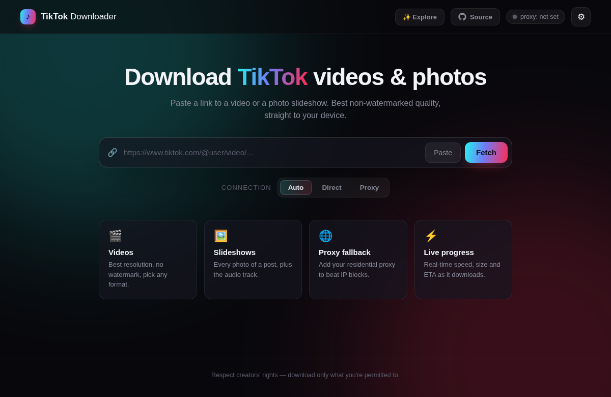
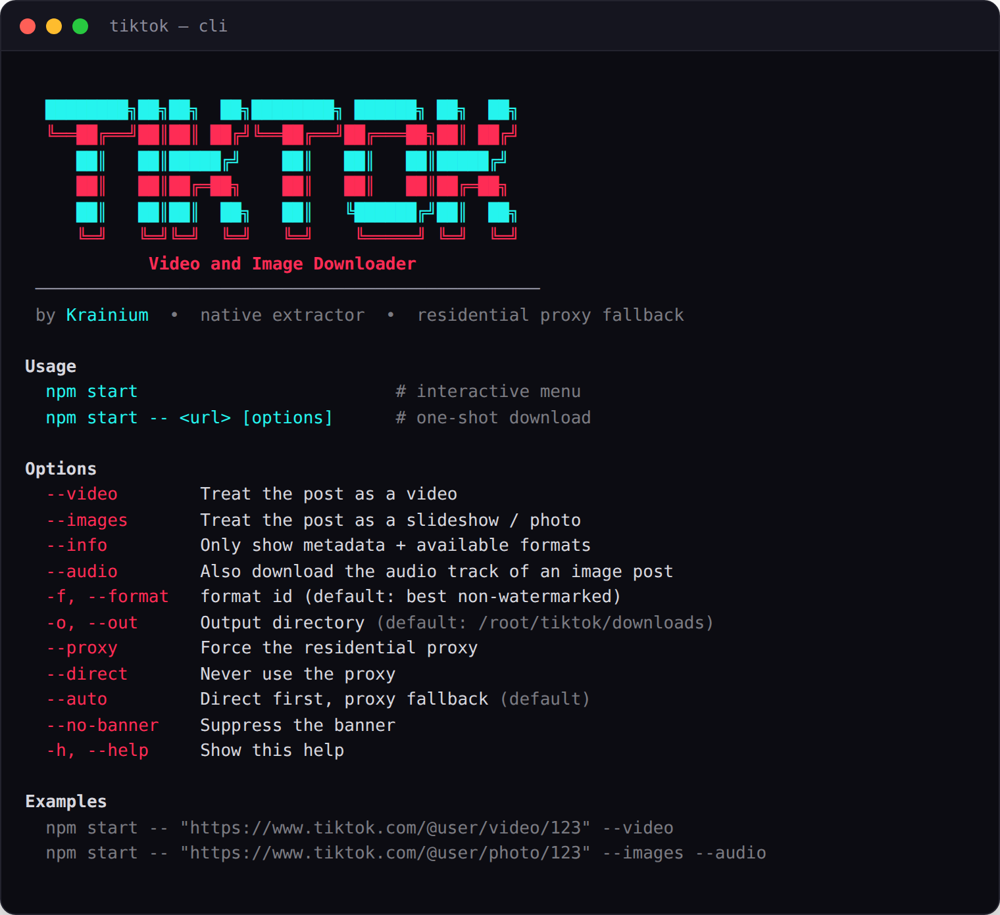

# TikTok Downloader

> Download TikTok videos and image slideshows — CLI tool and full web app.

**Live:** [tiktok-downloader-ehxq.onrender.com](https://tiktok-downloader-ehxq.onrender.com)

Native TypeScript engine that hits TikTok's own endpoints the way the apps do. No yt-dlp, no ffmpeg, no binaries. Pulls videos in best non-watermarked quality and every photo of a slideshow post, plus the audio track. Automatic residential-proxy fallback for when a datacenter IP gets blocked.

<p align="center">
  <br /><br />
  
</p>

---

## Web App

A dark, no-signin web UI served on **port 4444** — paste a link, pick a format, download.

### Features

- **Videos & slideshows** — best resolution video, or every image of a photo post with its audio.
- **Live progress** — real-time size, speed and ETA streamed over SSE.
- **Explore** — a slideshow of live trending TikToks to test instantly; captured from the real feed with a headless browser, falling back to oEmbed previews.
- **Bring your own proxy** — add a residential proxy in Settings (or env); nothing is baked into source.
- **Splash screen** and ambient effects, built with React + Vite.

### Run it

```bash
# Docker (production)
docker build -t tiktok . && docker run -p 4444:4444 tiktok

# Local
npm install && npm run web        # build + serve on :4444
```

Then open `http://localhost:4444`.

### Deploy

Ships with a `Dockerfile` and `render.yaml` for one-click Render deploys. Set `TIKTOK_PROXY_*` in the dashboard; set `EXPLORE_LIVE=1` on a ≥1 GB plan for the live-browser trending feed (leave `0` on free).

**Vercel** uses `Dockerfile.vercel` instead, which adds Xray-core beside the server. Requests leave through a pool of VLESS nodes read from `VLESS_NODES` (one `vless://` URI per line, set in the project environment — not committed). Each instance pins one exit, so extraction and the CDN download share an IP.

Because Vercel runs several instances, job state and finished files are mirrored to Vercel Blob when `BLOB_READ_WRITE_TOKEN` is set — otherwise the progress stream and file downloads break when a request lands on an instance that did not start the job. Without the token this is inert and behaves as on Render.

---

## CLI Tool

Download from the terminal — interactive menu or one-shot.

### Run it

```bash
npm start                                   # interactive menu
npm start -- "https://www.tiktok.com/@user/video/123"   # one-shot
```

### Options

| Flag | Description |
|---|---|
| `--video` / `--images` | Force how the post is treated |
| `--info` | Show metadata + formats only |
| `--audio` | Also download an image post's audio track |
| `-f, --format <id>` | Format id (default: best non-watermarked) |
| `-o, --out <dir>` | Output directory |
| `--proxy` / `--direct` / `--auto` | Proxy mode (default `auto`) |

### Proxy modes

- **auto** (default): direct first, fall back to the residential proxy on block.
- **proxy**: always through the proxy.
- **direct**: never use the proxy.

Set the proxy via menu option `[6]` or `TIKTOK_PROXY_HOST` / `TIKTOK_PROXY_PORT` / `TIKTOK_PROXY_USER` / `TIKTOK_PROXY_PASS`. Credentials are redacted from all logs.

> Node.js ≥ 18 required.
